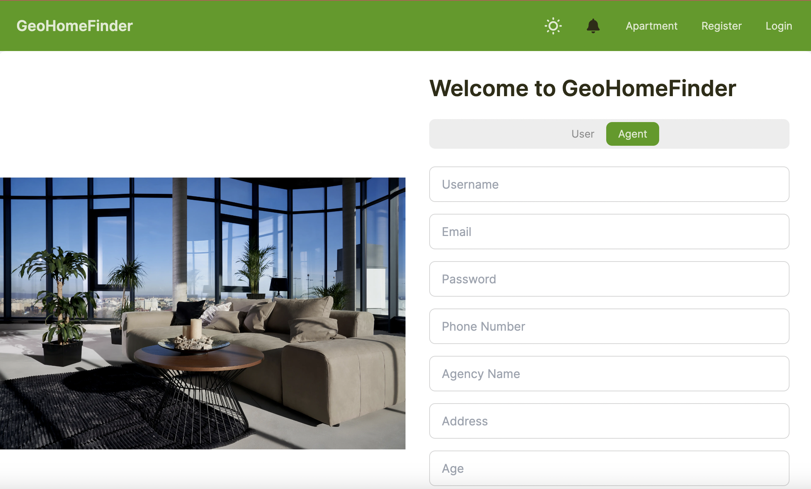
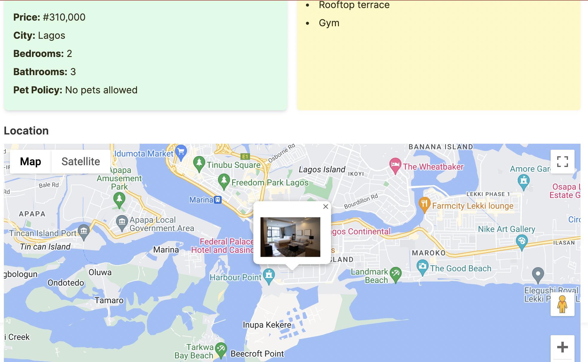

# GeoHomeFinder Application

## Introduction

Welcome to the **GeoHomeFinder** application repository, a user-friendly web platform designed to simplify the process of finding and searching for apartments. Integrated with Google Maps, our application provides an intuitive and interactive experience for both potential renters and real estate agents.

## Features

- **Google Maps Integration**: Locate apartments on an interactive map.
- **User Registration**: Two user roles - Normal Users and Agents.
- **Agent Functionality**: Agents can upload images and details of houses.
- **User Interactions**: Normal users can chat with agents directly within the application.
- **Simple Interface**: Easy to use and accessible for all users.

## Technology Stack

- **Frontend**: Next.js with TypeScript
- **Backend**: JavaScript
- **Database**: MongoDB

## User Roles

- **Agent**: Upload house listings, manage properties, interact with renters.
- **Normal User**: Search for apartments, view listings on a map, communicate with agents.

## Getting Started

### Prerequisites

- A modern web browser.
- Internet connection.

### Installation

No installation is required. Access the application directly through your web browser.

## Usage

1. **Register/Login**: Sign up or log in as an Agent or Normal User.
2. **Browse Listings**: Find apartments using the Google Map integration.
3. **Agent Listing Management**: Agents can upload and manage property listings.
4. **User-Agent Interaction**: Chat and interact directly through the application.

## Contributing

Contributions are welcome to enhance GeoHomeFinder. Please see `CONTRIBUTING.md` for contribution guidelines.

## License

GeoHomeFinder is licensed under the MIT License - see the `LICENSE` file for details.

## Contact

For more information, contact [support@geohomefinder.com](mailto:support@geohomefinder.com).
